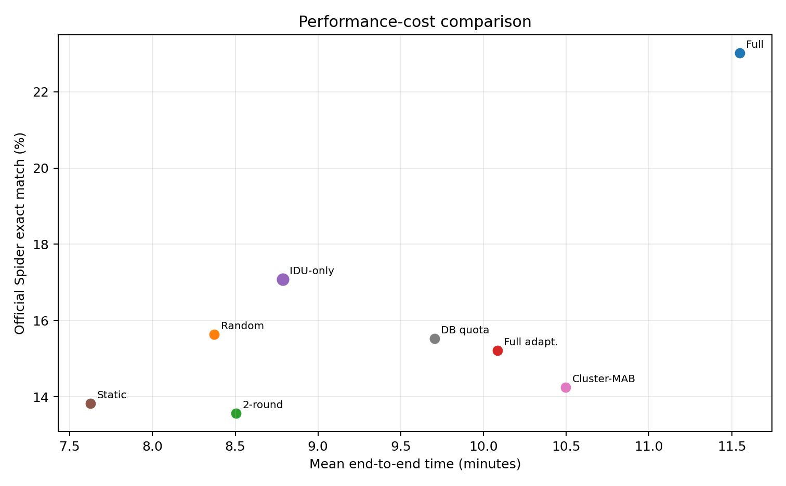
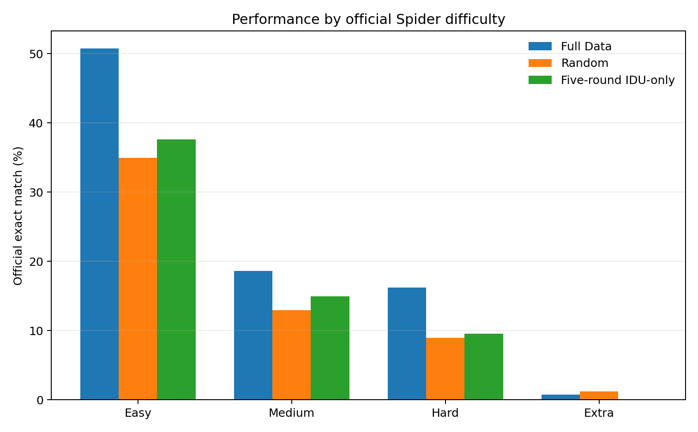
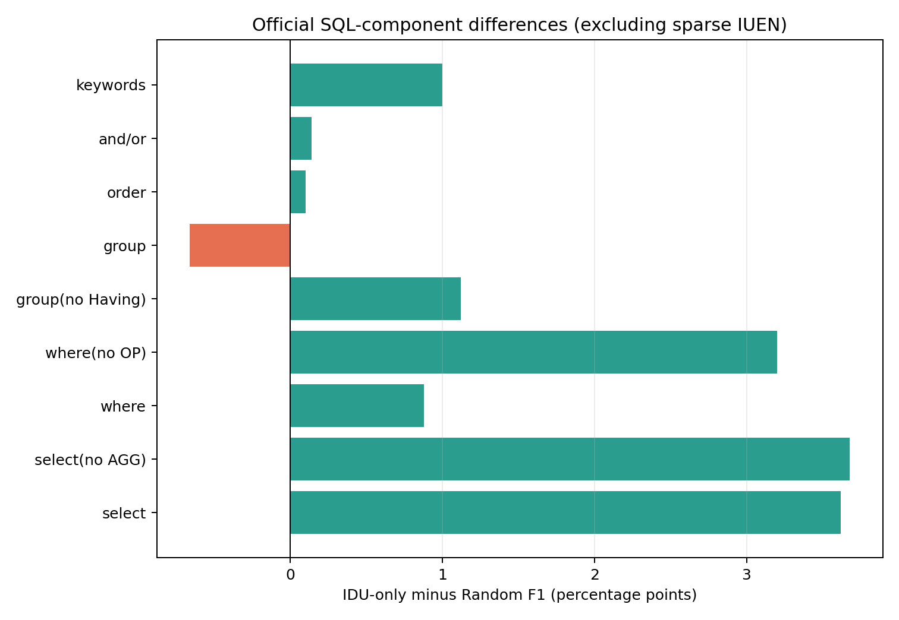

# Spider Data Selection: Consolidated Results and Critical Analysis

## Experimental boundary

All methods use Spider 1.0, CodeT5-small, a 1,000-example candidate pool, five fixed seeds, and official Spider exact match on the 1,034-example development set. Selected-data methods use a total budget of 500 examples. The five-round methods use the same cumulative training schedule and optimizer-step budget. The present methods are transparent adaptations of LEAD concepts, not a faithful reproduction of every LEAD component.

## Main performance and cost comparison

| Method | Official EM (mean ± SD) | End-to-end time | Selected DBs |
|---|---:|---:|---:|
| Full Data | 23.02% ± 1.83 pp | 692.8 s | 137.0 |
| Random | 15.64% ± 1.13 pp | 502.4 s | 126.8 |
| Two-round Iterative | 13.56% ± 1.92 pp | 510.3 s | 124.0 |
| Five-round Full Adaptation | 15.22% ± 2.96 pp | 605.0 s | 123.2 |
| Five-round IDU-only | 17.08% ± 2.39 pp | 527.3 s | 119.2 |
| Static Uncertainty | 13.82% ± 2.37 pp | 457.5 s | 114.0 |
| Cluster-MAB Component | 14.24% ± 1.13 pp | 629.8 s | 120.2 |
| Database-quota Component | 15.52% ± 2.04 pp | 582.3 s | 111.0 |

## Primary finding

Five-round IDU-only is the strongest selected-data method: 17.08%, compared with 15.64% for Random. The paired mean gain is 1.44 percentage points, with wins in 3 of 5 seeds. However, the 95% paired interval [-2.61, 5.49] percentage points crosses zero. This is promising but not conclusive evidence of superiority.

Full Data remains substantially stronger at 23.02%. IDU-only uses 23.9% less end-to-end time in this local setup, but loses 5.94 percentage points. The current result therefore supports a cost-quality trade-off, not parity with full-data training.

## What the component ablations show

- Updating utility between rounds matters: IDU-only exceeds the fixed static-uncertainty control by 3.26 percentage points.
- The complete five-round adaptation is weaker than IDU-only by 1.86 percentage points. This indicates that adding all allocation components does not automatically help in the small Spider setting.
- The cluster-MAB component is weaker than IDU-only in all five seeds, suggesting that the present two-cluster reward allocation is too coarse or unstable.
- Database-quota allocation also underperforms IDU-only and covers fewer databases on average. Proportional quotas do not guarantee broader or more useful coverage.

## Official difficulty breakdown

| Method | Easy | Medium | Hard | Extra | All |
|---|---:|---:|---:|---:|---:|
| Full Data | 50.72% | 18.62% | 16.20% | 0.72% | 23.02% |
| Random | 34.94% | 12.96% | 8.96% | 1.20% | 15.64% |
| Five-round IDU-only | 37.64% | 14.94% | 9.54% | 0.00% | 17.08% |

The gain from IDU-only is not uniform across difficulty levels. This breakdown should be used to identify where iterative utility updating helps and where errors remain concentrated, rather than relying only on the overall mean.

## Official SQL-component F1

| Component | Full Data | Random | Five-round IDU-only | IDU − Random |
|---|---:|---:|---:|---:|
| select | 53.14% | 44.56% | 48.18% | +3.62 pp |
| select(no AGG) | 54.24% | 45.72% | 49.40% | +3.68 pp |
| where | 28.26% | 21.82% | 22.70% | +0.88 pp |
| where(no OP) | 32.66% | 26.42% | 29.62% | +3.20 pp |
| group(no Having) | 46.04% | 32.84% | 33.96% | +1.12 pp |
| group | 41.54% | 29.84% | 29.18% | -0.66 pp |
| order | 45.72% | 36.14% | 36.24% | +0.10 pp |
| and/or | 96.16% | 96.16% | 96.30% | +0.14 pp |
| IUEN | 24.76% | 61.90% | 6.64% | -55.26 pp |
| keywords | 49.12% | 38.64% | 39.64% | +1.00 pp |

These official partial-match scores locate the structural sources of the overall difference. They are diagnostic component scores and should not be substituted for official exact match. IUEN is rare in this evaluation and its reported F1 is unstable when a run has no matching predictions, so the large IUEN difference should not be interpreted alone.

## Selection behaviour

The mean Jaccard overlap between IDU-only and Random selections is only 0.329, confirming that IDU changes which examples are chosen. IDU-only covers 119.2 databases on average, compared with 126.8 for Random. Its advantage therefore does not come from maximising raw database count alone; it is more consistent with repeatedly updating which remaining examples are informative.

## Diagnostic examples

These examples use normalized string exact match for diagnosis only. Official Spider exact match remains the primary reported metric.

Examples more consistently solved by IDU-only:

- `spider_000371_cre_Doc_Template_Mgt` (cre_Doc_Template_Mgt, advanced): IDU 4/5 vs Random 0/5 — List all document ids with at least two paragraphs.
- `spider_000702_world_1` (world_1, simple): IDU 4/5 vs Random 0/5 — What are the names of all the countries that became independent after 1950?
- `spider_000963_dog_kennels` (dog_kennels, simple): IDU 4/5 vs Random 0/5 — What are the emails of the professionals living in either the state of Hawaii or the state of Wisconsin?
- `spider_000003_concert_singer` (concert_singer, advanced): IDU 3/5 vs Random 0/5 — What are the names, countries, and ages for every singer in descending order of age?
- `spider_000274_employee_hire_evaluation` (employee_hire_evaluation, advanced): IDU 4/5 vs Random 1/5 — Sort all the shops by number products in descending order, and return the name, location and district of each shop.

Examples more consistently solved by Random:

- `spider_000619_tvshow` (tvshow, simple): IDU 0/5 vs Random 4/5 — What is the air date of TV series with Episode "A Love of a Lifetime"?
- `spider_000681_poker_player` (poker_player, simple): IDU 0/5 vs Random 4/5 — Show names of people whose nationality is not "Russia".
- `spider_000300_cre_Doc_Template_Mgt` (cre_Doc_Template_Mgt, simple): IDU 2/5 vs Random 5/5 — What are the ids, names, and descriptions for all documents?
- `spider_000320_cre_Doc_Template_Mgt` (cre_Doc_Template_Mgt, simple): IDU 0/5 vs Random 3/5 — What are the ids, version numbers, and type codes for each template?
- `spider_000325_cre_Doc_Template_Mgt` (cre_Doc_Template_Mgt, simple): IDU 0/5 vs Random 3/5 — How many templates have template type code CV?

### Heuristic error categories

Heuristic multi-label taxonomy over normalized-string mismatches. It supports qualitative diagnosis but is not an official Spider metric.

| Error tag | Random | Five-round IDU-only |
|---|---:|---:|
| aggregation | 26.35% | 25.86% |
| filtering | 17.88% | 15.09% |
| grouping | 21.45% | 20.82% |
| having | 6.80% | 5.82% |
| join | 46.52% | 44.63% |
| limit | 8.52% | 8.77% |
| ordering | 8.50% | 8.28% |
| other_identifier_value_or_structure | 15.14% | 16.00% |
| projection_or_identifier | 67.58% | 66.26% |
| set_operation | 8.83% | 8.86% |

## Limitations and next decision

1. Five seeds are enough to expose instability but not enough for a strong statistical claim.
2. CodeT5-small has a large remaining gap to Full Data, especially on structurally difficult queries.
3. The IDU proxy is observed loss change after training; it is an explicit practical adaptation rather than LEAD's full inference-free formulation.
4. MAB and quota variants may be disadvantaged by the small pool, few rounds, and coarse grouping choices.

The next priority should be manual verification of representative errors and consolidation into the mini-project report. A larger model or broader budget sweep is secondary unless additional compute becomes available.
